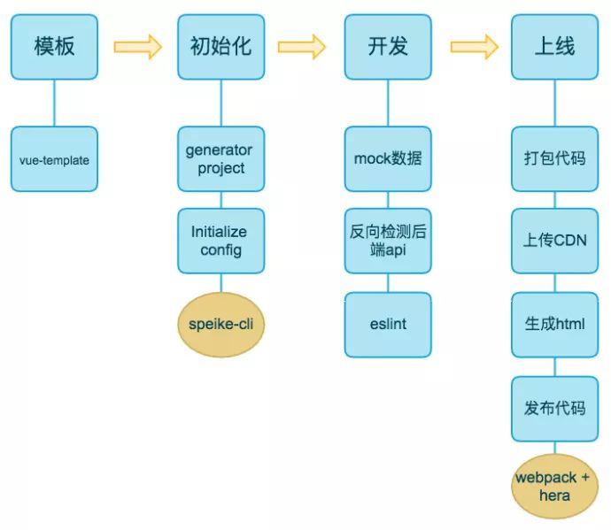

## LOVE-GO简介
实现一个购物商城，基本功能包括:注册、登录、商品展示、订单和购物车、分类搜索、会员、定位、支付、评论等功能。
### 技术选型:
前端(webpack+vue+sass+axios+vuex+vue-router+elementUI+eslint+PWA) 
服务端(koa2+mongoose)

部署: 阿里云/腾讯云 + deploy(编译源码) + cdn + pm2 + docker

### 目录结构
\| - README 
\| - build 
...
\| - src 
 &nbsp;&nbsp;&nbsp;&nbsp;--- App.vue 
 &nbsp;&nbsp;&nbsp;&nbsp;--- api  接入后端服务的api 
 &nbsp;&nbsp;&nbsp;&nbsp;--- assets (iconfonts,webp,png,scss) 
 &nbsp;&nbsp;&nbsp;&nbsp;--- components 组件(所有组件) 
&nbsp;&nbsp;&nbsp;&nbsp;--- main.js vue入口文件 
&nbsp;&nbsp;&nbsp;&nbsp;--- router 路由 
&nbsp;&nbsp;&nbsp;&nbsp;--- store (modules状态管理) 
&nbsp;&nbsp;&nbsp;&nbsp;--- util (通用函数)  
&nbsp;&nbsp;&nbsp;&nbsp;--- plugins (通用的插件) 
&nbsp;&nbsp;&nbsp;&nbsp;--- view (各个页面)

-static (静态文件) 
-test

### 项目工程化的生命周期

